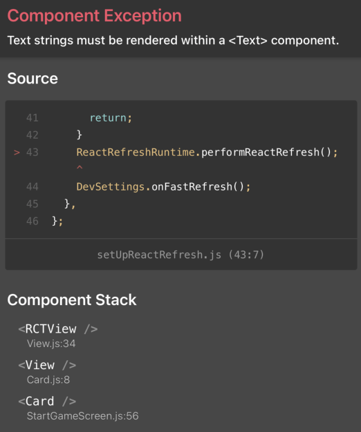

### Project Setup

1) Install `Expo` client

	- this behaves as a `wrapper` around your `React Native App`
	- `Expo` is a third-party service that provides a convenient development workflow to reduce the complexity of implementing `React Native` features from scratch
	- `Expo` limits the full control available in the `React Native` development environments available in `Xcode` and `Android Studio`

		~~~ bash
		npm install expo-cli --global
		~~~

2) Create a `React Native` project using `expo-init  [projectName]`

   - choose the `blank` template
   - in the underlined `name` field, enter a name. This will show up in the browser tab when the project is launched

		~~~ bash
		expo init reactnative_components_exp
		~~~

3) Launch project into the browser
	- use `yarn start` or `npm start` from the terminal
	- this will launch in the browser on port `http://localhost:19002/`
	- use `CTRL + C` to quit
	- while launched, open `VS Code` to see the default code and review `App.js`

4) Launch the project on your iPhone
	- Install `Expo client` from the app store
	- Open the `iPhone camera app` and hold it over the `QR code`

5) Launch the project on the Xcode iPhone simulator
	- install Xcode
	- make sure `Command Line Tools` is installed under `Preferences/Locations`

	- Launch the iPhone simulator by either:
		- select `Run on iOS simulator` from the `Expo client` browser window on port `http://localhost:19002/`
    	- pressing `i` from the terminal window after starting project

6)  Launch the project on the Android simulator
	- install Android Studio
    - under Configure-SDK Manager, select several Android SDK Platform packages
    - under Configure-AVD Manager, select the `play` button on one of the installed `Virtual Devices`

  	- Launch the iPhone simulator by either:
        - select `Run on Android simulator` from the `Expo client` browser window on port `http://localhost:19002/`
        - pressing `a` from the terminal window after starting project

### App Setup

1) Update `App.js`

    - a custom `Header` component is imported
    - the `flex: 1` style defines the proportion of available space this component will fill
    - the `title` prop is passed into the `Header` component

    ~~~ js
    // App.js
    import { StatusBar } from 'expo-status-bar';
    import React from 'react';
    import { StyleSheet, Text, View } from 'react-native';
    import Header from './components/Header';

    export default function App() {
    return (
        <View style={styles.screen}>
            <Header title = "Guess a Number" />
        </View>
    );
    }

    const styles = StyleSheet.create({
    screen: {
        flex: 1,

    },
    });
    ~~~

2) Create custom Header component

    ~~~ js
    // components/Header.js
    import React from 'react';
    import {View, Text, StyleSheet} from 'react-native';

    const Header = props => {
        return (
            <View style = {styles.header}>
                <Text style = {styles.headerTitle} > {props.title} </Text>
            </View>    
        )
    }

    export default Header;

    const styles = StyleSheet.create({
        header: {
            width: '100%',
            height: 90,
            paddingTop: 36, 
            backgroundColor: '#f7290b',
            alignItems: 'center',
            justifyContent: 'center',

        },
        headerTitle: {
            color: 'black',
            fontSize: 18
        }

    })
    ~~~

3) Create StartGameScreen component

    - style attributes that are prefixed with `shadow` only work with `iOS`
    - the `elevation` style only works with `Android`

    ~~~ js
    import React from 'react';
    import {View, Text, TextInput, StyleSheet, Button} from 'react-native';

    const StartGameScreen = props => {
        return (
            <View style = {styles.screen}>
                <Text style = {styles.title} > Start a New Game </Text>
                <View style = {styles.inputContainer}>
                    <Text> Select a Number </Text> 
                    <TextInput />
                    <View style = {styles.buttonContainer}>
                        <Button title = 'Reset' onPress = {() => {}} />
                        <Button title = 'Confirm' onPress = {() => {}} />
                    </View>                
                </View>
            </View>       
        )
    };

    const styles = StyleSheet.create({
        screen: {
            flex: 1,
            padding: 10,
            alignItems: 'center',

            },
        inputContainer: {
            backgroundColor: 'white',
            padding: 22,
            borderRadius: 10,   
            width: 300,
            maxWidth: '80%',
            alignItems: 'center',
            // shadow____   only works on iOS
            shadowColor: 'black',
            shadowOffset: {
                width: 0,
                height: 2,
            },
            shadowRadius: 6,
            shadowOpacity: 0.26,
            // these only work on Android
            elevation: 5,

            },
        title: {
            fontSize: 22,
            marginVertical: 10,

        
            },
        buttonContainer: {
            flexDirection: 'row',
            width: '100%',
            justifyContent: 'space-between',
            paddingHorizontal: 15,

        
            },

    })

    export default StartGameScreen;
    ~~~

4) Create `Card` component

    - overriding styles defined in `Card` with props is done using the `spread` operator 

        ~~~ js
        style = {{...styles.card, ...props.style}}
        ~~~

    - IMPORTANT !! putting spaces around `{props.children}` results in a `Component Exception Error`
    

    ~~~ js
    <View style = {{...styles.card, ...props.style}}> {props.children} </View>
    ~~~

    - add import and replace `View` with `Card` component in `StartGameScreen.js`
    - add the  `style` prop to the imported `Card` component

        ~~~ js
        // StartGameScreen.js
        ...
        import Card from '../components/Card';

        const StartGameScreen = props => {
            return (
                <View style = {styles.screen}>
                    <Text style = {styles.title} > Start a New Game </Text>
                    <Card style = {styles.inputContainer}>

                            <Text> Select a Number </Text> 
                            <TextInput />
                            <View style = {styles.buttonContainer}>
                                <Button title = 'Reset' onPress = {() => {}} />
                                <Button title = 'Confirm' onPress = {() => {}} />
                            </View>

                    </Card>
                </View>
            );
        };
        ...
        ~~~
  
    - the completed `Card` component

        ~~~ js
        // Card.js
        import React from 'react';
        import {View, StyleSheet} from 'react-native';

        const Card = props => {

            return (
                <View style = {{...styles.card, ...props.style}}> {props.children} </View>
            );

        };

        const styles = StyleSheet.create({
            card: {
                backgroundColor: 'white',
                padding: 22,
                borderRadius: 10,   
                // shadow____   only works on iOS
                shadowColor: 'black',
                shadowOffset: {
                    width: 0,
                    height: 2,
                },
                shadowRadius: 6,
                shadowOpacity: 0.26,
                // these only work on Android
                elevation: 5,

            },

        });

        export default Card;
        ~~~

5) Add styling to buttons

    - wrap each button in a `View` component to make each the same width
    - NOTE !! TO verify width using a colored border, `borderWidth` must be used with `borderColor`

~~~ js
// StartGameScreen.js
    ...
    <Card style = {styles.inputContainer}>

        <Text> Select a Number </Text> 
        <TextInput />
            <View style = {styles.buttonContainer}>
                <View style = {styles.buttonStyle}>
                    <Button title = 'Reset' color = '#B717FC' onPress = {() => {}} />                        
                </View>
                <View style = {styles.buttonStyle}>
                    <Button title = 'Confirm' color = '#97287c' onPress = {() => {}} />
                </View>                        
            </View>

    </Card>
    ...

    ...
    buttonStyle: {
    borderWidth: 4,
    borderColor: 'pink',
    width: '50%',
    
    }
~~~ 

6) Use constants for colors

    - define colors.js

    ~~~ js
    // colors.js            
    export default {
        primary: '#B717FC',
        accent: '#97287c',
        
    }
    ~~~

    - import into `StartGameScreen` and assign dynamic values to `colors`

    ~~~ js
    // StartGameScreen.js
    ...
    import Colors from '../constants/colors';
    ...

    const StartGameScreen = props => {
        return (
            <View style = {styles.screen}>
                <Text style = {styles.title} > Start a New Game </Text>
                <Card style = {styles.inputContainer}>

                        <Text> Select a Number </Text> 
                        <TextInput />
                        <View style = {styles.buttonContainer}>
                            <View style = {styles.buttonStyle}>
                                <Button title = 'Reset' color = {Colors.primary} onPress = {() => {}} />                        
                            </View>
                            <View style = {styles.buttonStyle}>
                                <Button title = 'Confirm' color = {Colors.accent} onPress = {() => {}} />
                            </View>                        
                        </View>

                </Card>
            </View>
        );
    };
    ~~~

7) Add TextInput component

    - props are spread in from where `Input` is used within `StartGameScreen` instead of defining variables within `Input` itself since state is defined within `StartGameScreen`
    - `styles.input` uses styles defined within the `Input` component
    - `props.style` uses styles defined from where `Input` is used within `StartGameScreen`

        ~~~ js
        // Input.js
        import React from 'react';
        import {TextInput, StyleSheet} from 'react-native';

        const Input = props => {
            return (
                <TextInput  {...props} style = {{ ...styles.input, ...props.style }} />
            
            )
        };

        const styles = StyleSheet.create({
            input : {
                // borderWidth: 1,
                // borderColor: 'seagreen',
                
                height: 30,
                borderBottomColor: 'grey',
                borderBottomWidth: 1, 
                marginVertical: 10,
            
            }

        });

        export default Input;
        ~~~

    - replace the `TextInput` component within `StartGameScreen` with the imported `Input` component

        ~~~ js
        // StartGameScreen.js
        ...
            <Text> Select a Number </Text> 
            {/* <TextInput />  */}
            <Input 
            style = {styles.input} 
            blurOnSubmit 
            autoCapitalize = 'none'
            autoCorrect = {false}  
            keyboardType = "number-pad"  
            maxLength = {2}
            />
            <View style = {styles.buttonContainer}>

        ...
        ~~~

8) Add handler for numeric input from user

    - `hooks` are used to manage state
    - a `regular expression` is used to allow only numeric input
    - `TouchableWithoutFeedback` wraps everything rendered from `StartGameScreen` 
    - `onPress  = {() => {Keyboard.dismiss()}` closes the numeric pad on iOS when the user clicks outside the `StartGameScreen` component
    - the `handleNumericInput` handler is called with `onChangeText`
    - the `Input` component is provided the  updated value prop

        ~~~ js
        // StartGameScreen.js
        ...
        const StartGameScreen = props => {

            const [numVal, setNumVal ] = useState('')

            const handleNumberInput = inputTextVal => {

                setNumVal(inputTextVal.replace(/[^0-9]/g, ''))        
            }
        ...
        ...
        <Input 
                style = {styles.input} 
                blurOnSubmit 
                autoCapitalize = 'none'
                autoCorrect = {false}  
                keyboardType = "number-pad"  
                maxLength = {2}
                onChangeText = {handleNumberInput}
                value = {numVal}
            />
        ...
        ~~~

9) Add handlers for Reset and Confirm

    - `Number.isNaN(chosenVal)` effectively recognizes `NaN` whereas `chosenVal === NaN` does not
    - 

        ~~~ js
        // StartGameScreen.js
        ...
        const [confirmed, setConfirmed] = useState(false)
        const [confirmedVal, setConfirmedVal] = useState('')
        ...
        ~~~

        ~~~ js
        ...
        const resetHandler = () => {
            setNumVal('');
            setConfirmed(false);
        
        }

        const confirmHandler = () => {

            const chosenVal = parseInt(numVal);
            // console.log("chosenVal is ", chosenVal)

            // Verify value is valid number 0
            
            if ( Number.isNaN(chosenVal) || chosenVal <= 0 || chosenVal > 99 || chosenVal === '') {
                setConfirmed(false);
                return;
            }

                setNumberMessage(chosenVal.toString());
                setConfirmed(true);
                setConfirmedVal(chosenVal);
                setNumVal('');

        
        }
        ...
        ~~~

   - user message is conditionally rendered based of boolean state of `confirmed`

        ~~~ js
        // StartGameScreen.js
        ...
        <Text> Enter a number </Text> 
        <Input 
            style = {styles.input} 
            blurOnSubmit 
            autoCapitalize = 'none'
            autoCorrect = {false}  
            keyboardType = "number-pad"  
            maxLength = {2}
            onChangeText = {handleNumberInput}
            value = {numVal}
        />
        <View style = {styles.buttonContainer}>
            <View style = {styles.buttonStyle}>
                <Button 
                    title = 'Reset' 
                    color = {Colors.primary} 
                    onPress = {resetHandler} />                        
            </View>
            <View style = {styles.buttonStyle}>
                <Button 
                    title = 'Confirm' 
                    color = {Colors.accent} 
                    onPress = {confirmHandler} 
                />
            </View> 
        </View>

        <View>
        { confirmed  
            ? 
                <Text> {numberMessage} confirmed </Text>
            : 
                null
        }
        </View> 
        ...
        ~~~

10) Add Alert for invalid inputs

    - import `Alert` from `react-native`

    - update logic that checks input

        ~~~ js
        // StartGameScreen.js
        ...
            if ( Number.isNaN(chosenVal) || chosenVal <= 0 || chosenVal > 99 || chosenVal === '') {
            //   the following does not detect NaN
            // if ( chosenVal === NaN || chosenVal <= 0 || chosenVal > 99 || chosenVal === '') {
                // setNumVal('');
                // console.log("numVal is ", numVal)
                setConfirmed(false);
                Alert.alert(
                    'Invalid input',  // title
                    'Enter a number from 1-99', // message 
                    [{
                        text: 'OK', // button text
                        style: 'destructive', // choices are: default, cancel, & destructive
                        onPress: resetHandler // callback 
                    }]
                )
                return;
            }
        ~~~

11) Add NumberContainer component

    ~~~ js
    // NumberContainer.js
    import React from 'react';
    import {View, Text, StyleSheet} from 'react-native';

    import Colors from '../constants/colors';

    const NumberContainer = props => {

        return (
            <View style = {styles.numberContainer}>
                <Text style = {styles.number} >{props.children}</Text>
            </View>
        )

    }

    const styles = StyleSheet.create({
        numberContainer: {
            borderWidth: 3,
            borderColor: Colors.borderNumContainer,
            padding: 5,
            color: Colors.borderNumContainer,
            // margin: 3,
            alignItems: 'center',
            justifyContent: 'center',
        
        
        },
        number: {
            color: Colors.numColor,
            fontSize: 30,
        
        }

    })

    export default NumberContainer
    ~~

12) Setup GameScreen component

    - `useRef` used to allows variables to persist between component re-renders

        ~~~ js
        // GameScreen.js
        import React, {useState, useRef} from 'react';
        import {Button, Text, View, StyleSheet, Alert} from 'react-native';

        import NumberContainer from '../components/NumberContainer';
        import Card from '../components/Card';

        // use function outside to not require re-render and improve performance
        // uses recursion to call itself from within

        const generateRandomBetween = (min, max, excludeVal) => {

            min = Math.ceil(min)    // rounds up number to next largest integer
            max = Math.floor(max)   // return largest integer <= the provided numerical argument

            const randomNum = Math.floor(Math.random() * (max-min) + min);

            // verify
            // do not allow first choice to given
            if (randomNum === excludeVal) {
                return generateRandomBetween(min, max, excludeVal);
            } else {
                return randomNum;
            }

        }

        const GameScreen = props => {

            const [currentGuess, setCurrentGuess] = useState(generateRandomBetween(1, 100, props.userNumber));

            // useRef creates obj that can be bound to inputs
            //   useRef allows values to persist throughout component re-renders
            const currentLow = useRef(1);
            const currentHigh = useRef(100)

            const nextGuessHandler = direction => {

                console.log( 'direction is ', direction );

                if (
                    (direction === 'lower' && currentGuess < props.userNumber) ||
                    (direction === 'higher' && currentGuess > props.userNumber)
                ) {
                Alert.alert("Don't lie!", 'You know that this is wrong...', [
                    { text: 'Sorry!', style: 'cancel' }
                ]);
                return;
                }
                if (direction === 'lower') {
                    currentHigh.current = currentGuess;
                } else {
                    currentLow.current = currentGuess;
                }

                const nextNumber = generateRandomBetween(currentLow.current, currentHigh.current, currentGuess);
                setCurrentGuess(nextNumber);
            }

            return (
                <View style = {styles.screen}>
                    {/* <Text> Computer guessed number {props.userNumber}</Text> */}
                    <Text> Computer guessed number </Text>
                    <NumberContainer> {currentGuess} </NumberContainer>
                    <Card style = {styles.buttonContainer}>
                        <Button title = 'Lower' onPress = {nextGuessHandler.bind(this, 'lower')} />
                        
                        <Button title = 'Higher' onPress = {nextGuessHandler.bind(this, 'higher')} />
                    
                    </Card>
                </View>    
            )
        }

        const styles = StyleSheet.create({
            screen: {
                borderWidth: 2,
                borderColor: 'darkred',
                
                margin: 20,
                flex: 1,
                padding: 8,
                alignItems: 'center',

            
            },
            buttonContainer: {
                
                margin: 20,
                flexDirection: 'row',
                justifyContent: 'space-between',
                width: '80%',
                maxWidth: '85%', 
            
            }

        })

        export default GameScreen;
        ~~~

13) Update `StartGameScreen` component

    - `numVal` state manages value from `Input` component
    - `confirmedVal` validates user input
    - `confirmed` boolean manages state of current valid input

        ~~~ js
        const [currentGuess, setCurrentGuess] = useState(generateRandomBetween(1, 100, props.userNumber));
        ~~~

  
    ~~~ js
    // StartGameScreen.js
    ...
    const StartGameScreen = props => {

        const [numVal, setNumVal ] = useState('')
        const [confirmed, setConfirmed] = useState(false)
        const [confirmedVal, setConfirmedVal] = useState('')

        const handleNumberInput = inputTextVal => {
            setNumVal(inputTextVal.replace(/[^0-9]/g, ''));        
        }

        const resetHandler = () => {
            setNumVal('');
            setConfirmed(false);        
        }

        const confirmHandler = () => {

            const chosenVal = parseInt(numVal);

            // Verify value is valid number           
                //   chosenVal === NaN does not detect NaN
            if ( Number.isNaN(chosenVal) || chosenVal <= 0 || chosenVal > 99 || chosenVal === '') {

                setConfirmed(false);
                Alert.alert(
                    'Invalid input',  // title
                    'Enter a number from 1-99', // message 
                    [{
                        text: 'OK', // button text
                        style: 'destructive', // choices are: default, cancel, & destructive
                        onPress: resetHandler // callback 
                    }]
                )
                return;
            }
                setNumberMessage(chosenVal.toString());
                setConfirmed(true);
                setConfirmedVal(chosenVal);
                setNumVal('');
                Keyboard.dismiss();            
        
        }

        return (
            <TouchableWithoutFeedback onPress = {() => {Keyboard.dismiss()}} >
                <View style = {styles.screen}>
                    <Text style = {styles.title} > Start a New Game </Text>
                    <Card style = {styles.inputContainer}>

                            <Text> Enter a number </Text> 
                            {/* <TextInput />  */}
                            <Input 
                                style = {styles.input} 
                                blurOnSubmit 
                                autoCapitalize = 'none'
                                autoCorrect = {false}  
                                keyboardType = "number-pad"  
                                maxLength = {2}
                                onChangeText = {handleNumberInput}
                                value = {numVal}
                            />
                            <View style = {styles.buttonContainer}>
                                <View style = {styles.buttonStyle}>
                                    <Button 
                                        title = 'Reset' 
                                        color = {Colors.primary} 
                                        onPress = {resetHandler} />                        
                                </View>
                                <View style = {styles.buttonStyle}>
                                    <Button 
                                        title = 'Confirm' 
                                        color = {Colors.accent} 
                                        onPress = {confirmHandler} 
                                    />
                                </View> 
                            </View>
                    </Card>

                    <View>
                    { confirmed  
                        ? 
                            <Card style = {styles.summaryContainer}>
                                {/* <NumberContainer>{numberMessage}</NumberContainer> */}
                                <NumberContainer> {confirmedVal} </NumberContainer>
                                <Text> chosen </Text>
                                <Button 
                                    title = 'Start Game ?'
                                    onPress = {() => props.startGameHandler(confirmedVal)}
                                />
                            
                            </Card>
                        : 
                            <Text> Ready for numerical input </Text>
                    }
                    </View>

                </View>    
            </TouchableWithoutFeedback>
        );
    };
    ...
    ~~~

14) Update `App` component

    - `content` variable defined to manage screen components
    - `userNumber` state determines re-assignment of `content` variable from default `StartGameScreen` to `GameScreen`
    - `startGameHandler` is passed down as a prop must into `StartGameScreen` and accepts validated `confirmedVal` user input

        ~~~ js
        // App.js
        import React, {useState} from 'react';
        import { StyleSheet, View } from 'react-native';
        import Header from './components/Header';
        import StartGameScreen from './screens/StartGameScreen';
        import GameScreen from './screens/GameScreen';

        export default function App() {

            // while userNumber exists, GameScreen component should be active
            const [userNumber, setUserNumber] = useState('');

            // currentGuess from GameScreen component should be passed into handler
            const startGameHandler = (selectedNumber) => {
                setUserNumber(selectedNumber);
                console.log('Chosen Number ', selectedNumber)
            }

            let content = <StartGameScreen startGameHandler = {startGameHandler} />;
            

            if (userNumber) {
                content = <GameScreen userNumber = {userNumber}/>
            } 

            return (
                <View style={styles.screen}>
                    <Header title = "Guess a Number" />
                    
                    {content}
                            
                </View>
            );
        }

        const styles = StyleSheet.create({
        screen: {
            flex: 1,

        },
        })
        ~~~

15) Create `GameOverScreen` component

    - displayed when computer 'guesses' user's `userNumber`

        ~~~ js
        import React from 'react';
        import {Text, View, Button, StyleSheet} from 'react-native';

        const GameOverScreen = props => {

            return (
                <View style = {styles.screen}>
                    <Text> Game Over ! </Text>
                    <Text> Number of Guess Attempts: {props.guessAttempts}</Text>
                    <Text> User's number was {props.userNumber} </Text>
                    <Button title = 'Play again' onPress = {props.startGameHandler} />
                </View>
            )
        }

        const styles = StyleSheet.create({
            screen: {
                flex: 1,
                justifyContent: 'center',
                alignItems: 'center',

            }

        })

        export default GameOverScreen;
        ~~~

16) Update `App` to handle counting guess atempts and game over

    - `guessAttempts` added to `App` state
    - `startGameHandler` will reset guesses to 0 from previous game 
    - `gameOverHandler` manages counting guesses

        ~~~ js
        // App.js
        ...
        import GameOverScreen from './screens/GameOverScreen';
        ...

        export default function App() {

            // while userNumber exists, GameScreen component should be active , NOT ''
            const [userNumber, setUserNumber] = useState();
            const [guessAttempts, setGuessAttempts] =  useState(0);

            // currentGuess from GameScreen component should be passed into handler
            const startGameHandler = (selectedNumber) => {
                setUserNumber(selectedNumber);
                setGuessAttempts(0)
                // console.log('Chosen Number ', selectedNumber)
            }

            const gameOverHandler = (attemptCount) => {
                setGuessAttempts(attemptCount)
            
            }
            ...
            if (userNumber && guessRounds <= 0) {
                console.log('userNumber is ', userNumber)
                content = <GameScreen 
                            userNumber = {userNumber} 
                            gameOverHandler = {gameOverHandler} 
                            
                          />
            } else if (guessAtempts) {
                content = <GameOverScreen />
    }

        ~~~

17) Add logic to `GameScreen` to detect if correct number guessed

    - useEffect used to check if userNumber is guessed by computer
    - destructuring added 
    - 'guessCount' added to local state and incremented within `nextGuessHandler`
    - 

        ~~~ js
        // GameScreen.js
        ...
        // destructure props
        const {userNumber, gameOverHandler} = props;
        
        // generate number 
        const [currentGuess, setCurrentGuess] = useState(generateRandomBetween(1, 100, userNumber));
        ...

        ...
        // define localState to count guesses within GameScreen component
        const [guessCount, setGuessCount] = useState(0);

        // useEffect runs AFTER component re-renders
        useEffect( () => {

            console.log("useEffect props.guessCount", guessCount);
            console.log("guessCount ", guessCount);

            if (currentGuess === props.userNumber) {
                gameOverHandler(guessCount);       
            }
        // }, [currentGuess, gameOverHandler, userNumber]);
        }, [currentGuess]);
        ...
        const nextGuessHandler = direction => {

        console.log( 'direction is ', direction );

        if (
            (direction === 'lower' && currentGuess < userNumber) ||
            (direction === 'higher' && currentGuess > userNumber)
        ) {
        ...
        ~~~

18) Update startGamehandler to handle starting new game before & after game played

    ~~~ js
    // App.js
    ...
    if (userNumber && guessAttempts <= 0) {
        console.log('userNumber is ', userNumber)
        content = (
            <GameScreen 
                userNumber = {userNumber} 
                gameOverHandler = {gameOverHandler}                     
            />
                
        )
    } else if (guessAttempts > 0) {
        content = (
        
            <GameOverScreen
                guessAttempts = {guessAttempts}
                userNumber = {userNumber}
                startGameHandler = {startGameHandler}
             />
        )
        
    }
    ~~~

### Setting up Custom Fonts

1) Create assets/fonts folder and add some font files 

2) Add imports

    ~~~ js
    // App.js
    import * as Font from 'expo-font';
    import { AppLoading } from 'expo'; // prolongss default loading of App screen until a particular task is done
    ~~~

3) Create `fetchFonts` function ouside main `App` function

    ~~~ js
    //App.js
    const fetchFont = () => {
        
        // returns a Promise
        Font.loadAsync({
        'atures100' : require('./assets/fonts/Atures-100_PERSONAL_USE.ttf'),
        'atures900' : require('./assets/fonts/Atures-900_PERSONAL_USE.ttf'),  // bolder
        'hemihead' : require('./assets/fonts/HEMIHEAD.TTF')

        });

    }
    ~~~

4) Create Hook and logic for managing `AppLoading`

    ~~~ js
        const [dataLoaded, setDataLoaded] = useState(false);

        if (!dataLoaded) {
            return (
                <AppLoading 
                    startAsync = {fetchFonts} 
                    onFinish = {() => setDataLoaded(true)}
                    onError = {() => console.log(err)}
                />
            
            )
            
        }
    ~~~